# week6-ntier-redis
## Build และ Start ระบบ
- 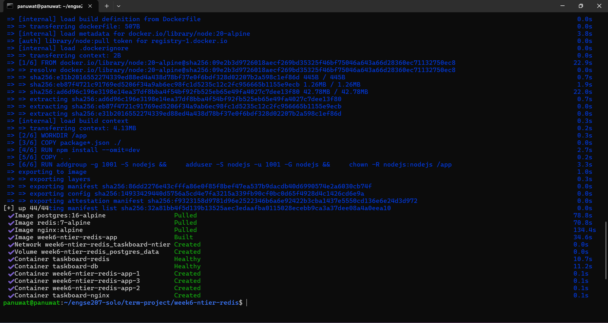
- 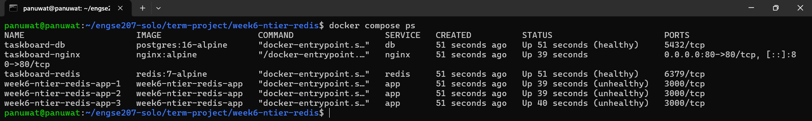

## wed
- 

## Testing & Monitoring
### ทดสอบ Load Balancing
- 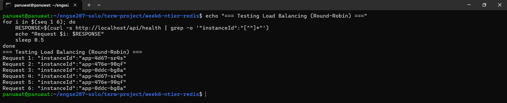
### ทดสอบ Redis Caching
- 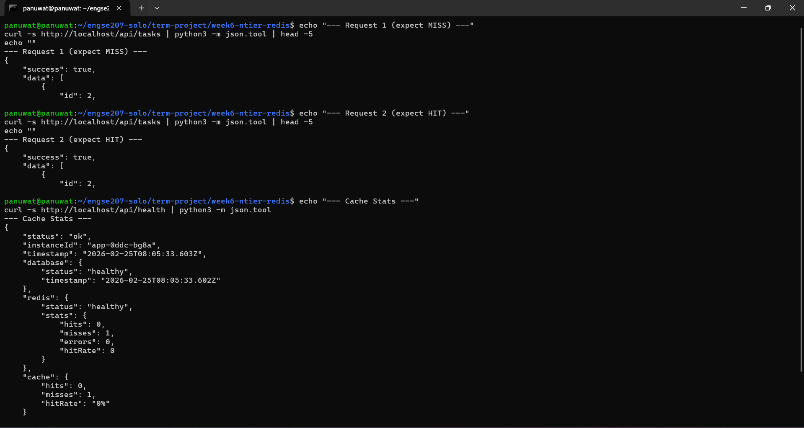
### ทดสอบ Cache Invalidation
- 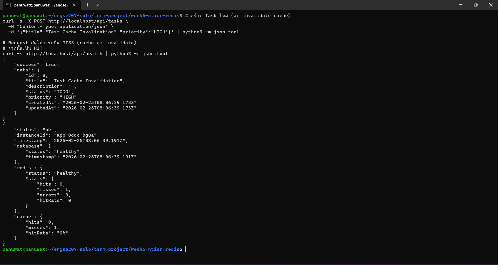
### Load Testing (Simple)
- 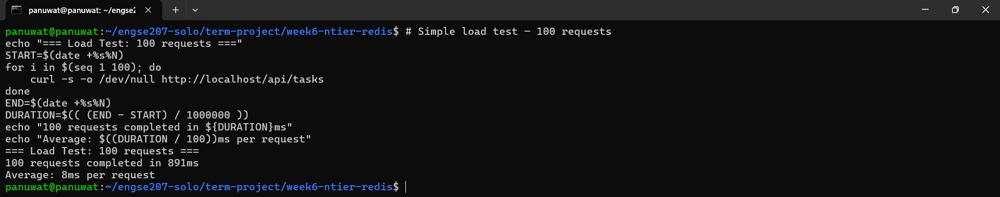
### Load Testing AD
#### full start 
- 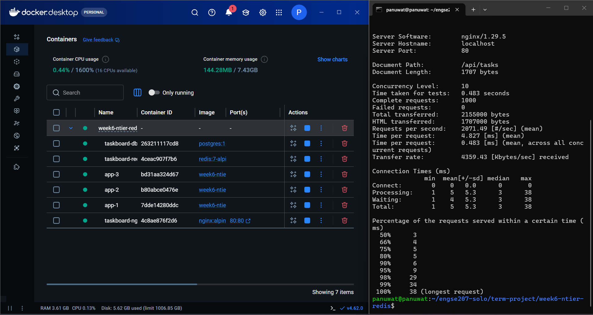
#### start server 1 + Redis
- 
#### start server 2 + Redis
- 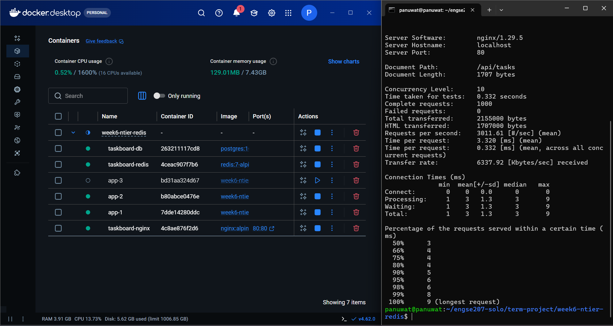
#### start server 3 - Redis
- 
#### start server 1 - Redis
- 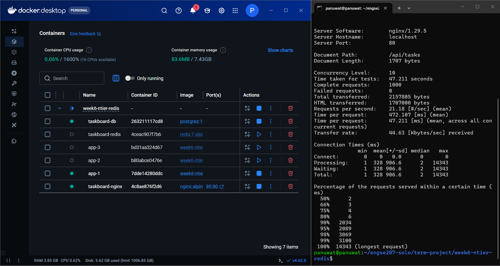

## Week 6 Challenge: N-Tier Architecture & Redis Caching

## 1. เปลี่ยน Load Balancing เป็น Least Connections
- **สิ่งที่ทำ:** ปรับตั้งค่า Upstream ในไฟล์ `nginx/conf.d/default.conf` ของ Nginx โดยเพิ่ม `least_conn;`
- **เหตุผลและผลลัพธ์:** เปลี่ยนอัลกอริทึมการกระจายโหลด (Load Balancing) จากค่าเริ่มต้น (Round-Robin) เป็น `least_conn` เพื่อให้ Nginx ตรวจสอบและส่ง Request ใหม่ไปยัง Instance ของ App (API) ที่กำลังรับภาระการเชื่อมต่อน้อยที่สุดในขณะนั้น ทำให้การกระจายโหลดมีความสมดุลมากขึ้น เหมาะกับระบบที่แต่ละ Request อาจใช้เวลาประมวลผลไม่เท่ากัน

**การเปลี่ยนแปลงโค้ด (`nginx/conf.d/default.conf`):**
```diff
 upstream app_servers {
     # Docker Compose จะ resolve ชื่อ "app" เป็น IP ของทุก instance
     # เมื่อ scale=3 จะได้ 3 IPs
+    least_conn;
     server app:3000;
 
     # Keepalive connections เพื่อ reuse TCP connections
     keepalive 32;
 }
```

## 2. เพิ่ม Cache สำหรับ `GET /tasks/:id`
- **สิ่งที่ทำ:** แก้ไขเมธอด `getTaskById` ใน `api/src/services/taskService.js` เพื่อทำงานร่วมกับ Redis และส่ง Source (HIT/MISS) ออกไปพร้อมกับข้อมูล
- **เหตุผลและผลลัพธ์:** ตอบสนองความต้องการในการเก็บ Cache เฉพาะ Task ID ผ่านรูปแบบ Cache-Aside และแนบสถานะกลับไปยัง Controller ว่าได้ข้อมูลมาจาก Cache หรือ Database ก่อนหน้าคืนค่า Data เป็น JSON ตอนนี้เปลี่ยนเป็น Object ที่มีโครงสร้าง `{ data: json, source: 'HIT'|'MISS' }`

**การเปลี่ยนแปลงโค้ด (`api/src/services/taskService.js`):**
```diff
     // GET task by ID — ใช้ Cache
     async getTaskById(id) {
         const cached = await getCache(CACHE_KEYS.TASK_BY_ID(id));
-        if (cached) return cached;
+        if (cached) return { data: cached, source: 'HIT' };
 
         const task = await taskRepository.findById(id);
         if (!task) {
             const error = new Error('Task not found');
             error.statusCode = 404;
             throw error;
         }
 
-        await setCache(CACHE_KEYS.TASK_BY_ID(id), task.toJSON(), 60);
-        return task.toJSON();
+        const json = task.toJSON();
+        await setCache(CACHE_KEYS.TASK_BY_ID(id), json, 60);
+        return { data: json, source: 'MISS' };
     }
```

## 3. เพิ่ม `X-Cache-Status` Header (HIT/MISS) ใน Response
- **สิ่งที่ทำ:** แก้ไข `api/src/controllers/taskController.js` เพื่อส่ง Header ออกไป และ `api/server.js` เพื่ออนุญาต CORS ของ Header ตัวนี้ให้ Frontend สามารถอ่านได้
- **เหตุผลและผลลัพธ์:** เพิ่ม HTTP Header ชื่อ `X-Cache-Status` ซึ่งจะแสดงค่า `HIT` หรือ `MISS` แนบไปกับการตอบกลับ (Response) ของ `GET /tasks/:id` เพื่อให้ผู้เรียกใช้งาน API สามารถตรวจสอบแหล่งที่มาของข้อมูลได้อย่างชัดเจนว่าถูกดึงมาจาก Cache (Redis) หรือต้องคิวรีใหม่ (Database)

**การเปลี่ยนแปลงโค้ดส่วนการแนบ Header (`api/src/controllers/taskController.js`):**
```diff
     async getTaskById(req, res, next) {
         try {
-            const task = await taskService.getTaskById(parseInt(req.params.id));
-            res.json({ success: true, data: task });
+            const result = await taskService.getTaskById(parseInt(req.params.id));
+            res.set('X-Cache-Status', result.source);
+            res.json({ success: true, data: result.data });
         } catch (error) { next(error); }
     }
```

**การเปลี่ยนแปลงโค้ดส่วนการอนุญาต CORS ให้ Frontend มองเห็น Header (`api/server.js`):**
```diff
 // Middleware
-app.use(cors());
+app.use(cors({ exposedHeaders: ['X-Cache-Status'] }));
 app.use(express.json());
 app.use(morgan('short'));
```

## ทดสอบการทำงาน

### 1. เริ่มระบบใหม่ผ่าน Docker Compose
```bash
docker-compose up -d --build --scale app=3
```
*คำสั่ง `--scale app=3` จะรัน API ขึ้นมา 3 ตัวเพื่อทดสอบ Load Balancing*
- 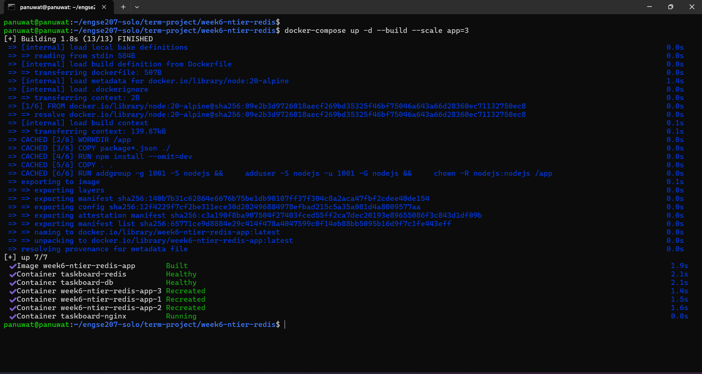

### 2. ทดสอบ Least Connections Load Balancing
ส่ง Request ไปยัง API หลายๆ ครั้งต่อเนื่องกัน:
```bash
for i in {1..30}; do curl -s -I http://localhost/api/tasks | grep X-Served-By; done
```
- 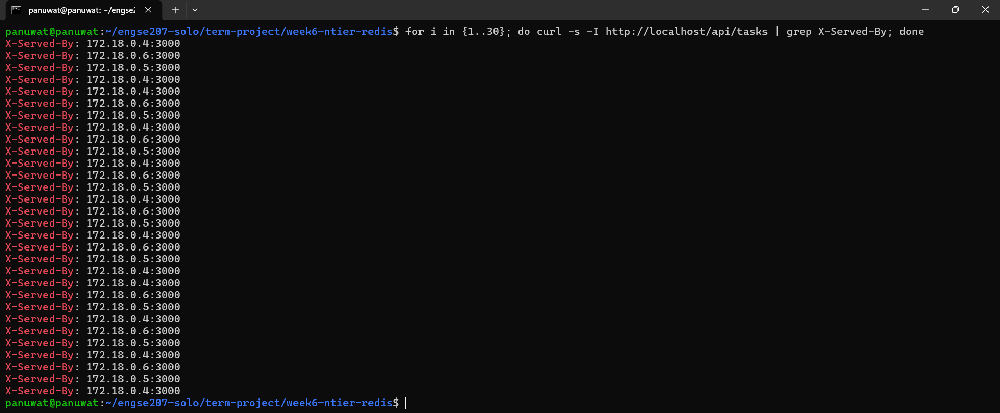

### 3. ทดสอบ Redis Cache และ X-Cache-Status Header
ทดสอบดึงข้อมูล Task 1 :
```bash
curl -i http://localhost/api/tasks/1
```
- 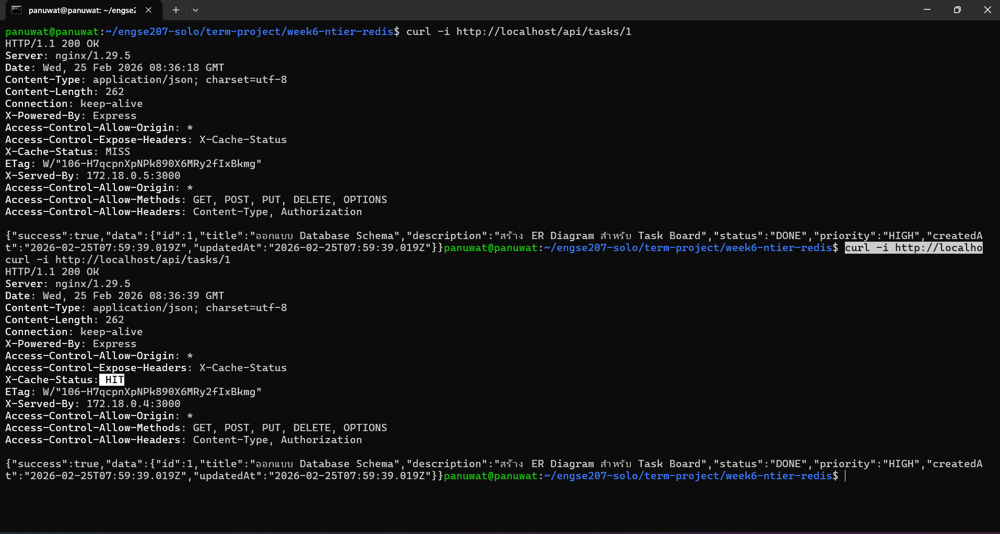

**ผลลัพธ์ครั้งแรก (Cache MISS):**
ในครั้งแรกจะได้ Response Header เป็น `X-Cache-Status: MISS` (เพราะยังไม่ได้เก็บลง Redis) พร้อมกับการตอบกลับข้อมูลจาก Database

**ผลลัพธ์ครั้งที่สอง (Cache HIT):**
ลองรันคำสั่งเดิมซ้ำอีกครั้งภายใน 60 วินาที จะได้ Response Header เปลี่ยนเป็น `X-Cache-Status: HIT` ทันที และความเร็วในการตอบสนองจะลดลงอย่างเห็นได้ชัด เนื่องจากคราวนี้ข้อมูลถูกดึงออกมาจากหน่วยความจำ Redis โดยตรง

