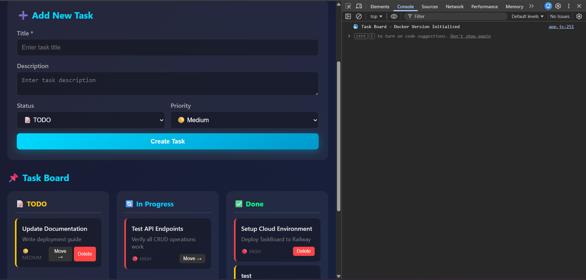
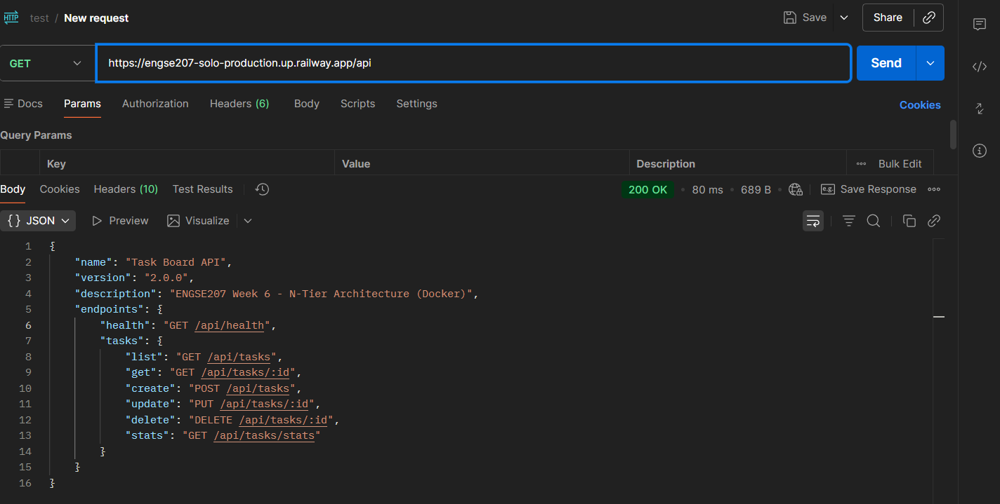

# 🚀 ENGSE207 Week 7: N-Tier Deployment on Railway

This project demonstrates the deployment of an N-Tier Architecture application using Docker containers on the Railway platform. The application consists of a Node.js backend API, a frontend web interface, and a PostgreSQL database.

## 🔗 Live Demo (Deployed on Railway)

| Service | URL | Status |
|---------|-----|--------|
| **Web Frontend** | [https://engse207-solo-production.up.railway.app/](https://engse207-solo-production.up.railway.app/) | ✅ Online |
| **Backend API** | [https://engse207-solo-production.up.railway.app/api](https://engse207-solo-production.up.railway.app/api) | ✅ Online |

---

## 📸 Screenshots

### Web Interface
The frontend application allows users to view and manage tasks.

### API Endpoint (`/api`)
The backend API provides endpoints for data retrieval and manipulation.

---

## ✨ Features

- **N-Tier Architecture**: Separated concerns between Presentation (Frontend), Logic (API), and Data (Database) tiers.
- **Dockerized**: Each component is containerized for consistency across environments.
- **Cloud Deployment**: Deployed to Railway for scalable and accessible hosting.
- **RESTful API**: Node.js/Express backend serving JSON data.
- **Database Integration**: Persistent storage using PostgreSQL.

## 🛠️ Tech Stack

- **Frontend**: HTML, CSS, JavaScript (served via Nginx)
- **Backend**: Node.js, Express.js
- **Database**: PostgreSQL
- **Infrastructure**: Docker, Railway

`
